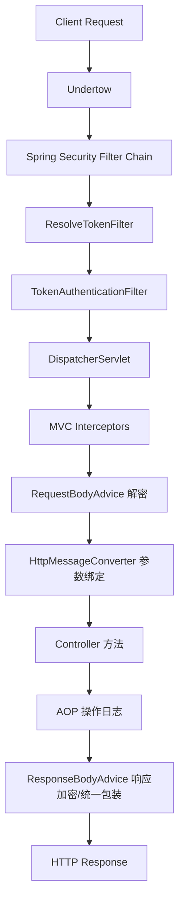

# 项目机制说明

## 1. 项目总览

当前项目是一个基于 Spring Boot 3、Spring Security、MyBatis-Plus、Redis 的后端模板，重点增强了以下几类能力：

- JWT 认证与无状态安全链路
- 基于 RSA + AES-GCM 的请求解密与响应加密
- 请求上下文与加密上下文透传
- 基于系统配置的动态开关能力
- 防重放校验、操作日志、统一返回与全局异常处理
- 针对请求体重复读取问题的缓存包装能力

## 2. 请求处理主链路

### 2.1 总体时序

### 2.2 关键结论

- Undertow 负责承载 Servlet 请求，但不是当前项目里“请求体被提前读空”的主要原因。
- 真正会消费请求体的关键阶段是 Spring MVC 的 `@RequestBody` 参数解析阶段，以及 `RequestBodyAdvice`。
- 只要请求经过 `RequestCachingFilter` 包装，后续再次读取 `HttpServletRequest` 的原始请求体时，通常不会因为前面已消费而直接变成空流。
- 即便 AOP 发生在 `EncryptRequestBodyAdvice` 之后，AOP 再次从 `HttpServletRequest` 读取到的仍然是“原始请求体缓存”，不是 `RequestBodyAdvice` 解密后的明文对象。

## 3. Security 过滤器链

### 3.1 当前链路中的主要过滤器

根据 `SecurityConfiguration`，当前项目的主要安全过滤器职责如下：

- `RequestCachingFilter`
  作用：在请求进入后续 Spring Security / MVC 链路前，先把原始请求体读取并缓存到内存中。
- `ResolveTokenFilter`
  作用：从请求头中提取 Access Token，去掉前缀，写入 request attribute，供后续过滤器使用。
- `TokenAuthenticationFilter`
  作用：校验 JWT、加载权限、建立 `SecurityContext`，并在 finally 中清理安全上下文与自定义上下文。

### 3.2 过滤器执行逻辑

#### RequestCachingFilter

核心职责：

- 把 `HttpServletRequest` 包装为 `RepeatableRequestWrapper`
- 在 wrapper 构造时一次性读取 `request.getInputStream()` 到 `byte[]`
- 后续每次 `getInputStream()` / `getReader()` 都从缓存字节数组回放

边界说明：

- 它解决的是“原始请求体重复读取”问题。
- 它不负责回写解密后的明文请求体。
- 它只对经过该过滤器之后的链路有效。

#### ResolveTokenFilter

执行步骤：

1. 从 `security.access.header` 指定的请求头取值
2. 去除 `security.access.prefix`
3. trim 后写入 request attribute
4. 不做真正认证，只做标准化传递

#### TokenAuthenticationFilter

执行步骤：

1. 从 request attribute 中取标准化 token
2. 使用 `JwtTokenHandler` 解析用户名与用户 ID
3. 校验 token 是否过期
4. 从 Redis 获取权限集合
5. 构建 `UsernamePasswordAuthenticationToken`
6. 写入 `SecurityContextHolder`
7. 放行到后续链路
8. finally 中清理 `SecurityContextHolder` 和 `ContextHolder`

## 4. MVC 拦截器链

### 4.1 注册顺序

`WebMvcConfiguration` 中的 MVC 拦截器顺序如下：

1. `SystemMaintenanceInterceptor`，`order = -1`
2. `TimestampInterceptor`，`order = 1`
3. `NonceInterceptor`，`order = 2`
4. `ContextClearInterceptor`，`order = Integer.MAX_VALUE`

### 4.2 各拦截器职责

#### SystemMaintenanceInterceptor

- 读取系统配置 `SYSTEM_MAINTENANCE`
- 若开启维护模式，则直接拒绝访问

#### TimestampInterceptor

- 读取请求头 `X-Timestamp`
- 获取允许的时间偏差配置
- 校验当前时间与请求时间戳差值
- 用于防止超时重放请求

#### NonceInterceptor

- 读取请求头 `X-Nonce`
- 获取 nonce 过期时间配置
- 使用 `CacheService.setIfAbsent` 写入缓存
- 若写入失败，则说明 nonce 已被使用，判定为重复请求或重放攻击

#### ContextClearInterceptor

- 在请求完成后统一清理 `ContextHolder`
- 防止线程复用导致 ThreadLocal 污染

## 5. 请求加解密机制

### 5.1 请求解密

请求解密由 `EncryptRequestBodyAdvice` 完成，它属于 Spring MVC 的 `RequestBodyAdvice` 链路。

执行步骤：

1. 判断系统配置是否开启传输加密
2. 判断方法或类上是否标记 `@IgnoreEncrypt`
3. 在 `beforeBodyRead` 中读取整个请求体
4. 将请求体解析为 `EncryptBody`
5. 使用 RSA 私钥解出 AES 密钥
6. 将 AES 密钥写入 `EncryptContext`
7. 使用 AES-GCM 解密数据体
8. 构造新的 `HttpInputMessage`，把明文交给后续 `HttpMessageConverter`

关键结论：

- Controller 拿到的 DTO 是解密后的业务对象。
- `HttpServletRequest` 本身不会被替换成“明文 request body”。
- 因此后续从 `HttpServletRequest` 读取出来的仍然是原始密文请求体缓存，而不是明文。

### 5.2 响应加密

响应加密由 `EncryptResponseBodyAdvice` 完成。

执行步骤：

1. 判断系统配置是否开启传输加密
2. 判断方法或类上是否标记 `@IgnoreEncrypt`
3. 从 `EncryptContext` 中读取当前请求 AES 密钥
4. 将响应对象转为字符串
5. 使用 AES-GCM 加密响应数据
6. 返回 `EncryptResult`

### 5.3 统一返回包装

`ResultResponseBodyAdvice` 在响应链路上晚于 `EncryptResponseBodyAdvice` 执行，职责是：

- 普通对象包装成 `Result.success(data)`
- `EncryptResult` 包装成包含 `data + iv` 的统一结构
- `String` 响应转 JSON 字符串返回

## 6. AOP 与请求体读取关系

### 6.1 执行时机

对于 Controller 方法上的切面，AOP 的执行时机晚于 `EncryptRequestBodyAdvice` 和 `HttpMessageConverter` 参数绑定。

也就是说：

- AOP 发生时，Controller 入参已经完成解密和绑定
- 但 `HttpServletRequest` 上保留的仍然是原始请求体语义

### 6.2 OperationLogAspect 当前行为

`OperationLogAspect` 当前会做三类采集：

- URL、方法、IP、请求参数
- 通过 `request.getReader()` 读取请求体
- 如果请求体取不到，则回退到 `joinPoint.getArgs()` 的业务参数序列化

因此要注意：

- 如果关注的是“原始密文请求体”，可以从 `HttpServletRequest` 读取。
- 如果关注的是“解密后的业务明文”，优先使用 `joinPoint.getArgs()` 或者在 `RequestBodyAdvice` 中额外透传明文。

## 7. RequestCachingFilter 的适用边界

### 7.1 能解决的问题

当前实现可以较好解决：

- AOP、过滤器、工具类多次读取原始请求体
- `@RequestBody` 消费后再次读取变空流的问题

### 7.2 不能解决的问题

当前实现不能直接解决：

- 把 `RequestBodyAdvice` 解密后的明文重新写回 `HttpServletRequest`
- 大文件 / `multipart/form-data` 场景下的内存占用问题
- 在它之前就已经读取过请求体的更早层过滤器问题

### 7.3 当前项目里的结论

针对当前项目主链路：

- 后续代码再次读取 `HttpServletRequest` 时，大概率可以继续拿到原始请求体
- 但拿到的是原始缓存体，不是解密后的 DTO 明文

## 8. 上下文机制

### 8.1 ContextHolder 结构

`ContextHolder` 统一持有两类上下文：

- `UserContext`
- `EncryptContext`

二者内部都基于 `ThreadLocal` 保存当前线程相关数据。

### 8.2 UserContext

`UserContext` 保存：

- `userId`
- `userName`
- `userToken`

适用场景：

- 业务日志记录
- 审计信息写入
- 子线程任务传递用户身份信息

### 8.3 EncryptContext

`EncryptContext` 保存：

- 当前请求解出的 AES 密钥

适用场景：

- 请求解密后把 AES 密钥交给响应加密复用

### 8.4 清理机制

当前项目有两层清理：

- `TokenAuthenticationFilter` 的 finally 清理 `ContextHolder` 和 `SecurityContextHolder`
- `ContextClearInterceptor.afterCompletion` 兜底清理 `ContextHolder`

设计目的：

- 保证线程池或容器线程复用时不会串数据
- 降低请求上下文泄漏风险

## 9. 线程池上下文透传机制

### 9.1 ContextCopyingDecorator

`ContextCopyingDecorator` 用于把主线程上下文拷贝到异步线程。当前会透传：

- `RequestAttributes`
- `SecurityContext`
- `UserContext`
- `EncryptContext`

### 9.2 执行流程

1. 在主线程捕获当前上下文快照
2. 包装原始 `Runnable`
3. 在子线程执行前设置上下文
4. 执行业务逻辑
5. finally 中清理请求属性和自定义上下文

### 9.3 价值

它解决的是：

- 异步线程里拿不到登录态
- 异步线程里拿不到加密上下文
- MDC / RequestAttributes 丢失导致链路日志不完整

## 10. 系统配置与缓存机制

### 10.1 SysConfigHandler

系统配置统一由 `SysConfigHandler` 读取，对外提供布尔开关和数值配置访问能力，例如：

- 是否开启数据传输加密
- 是否开启防重放
- 是否开启系统维护
- token 过期时间
- nonce 过期时间

### 10.2 缓存读取逻辑

读取流程：

1. 根据 `SysConfigKey` 构造缓存 key
2. 使用 `CacheService.getOrLoad`
3. 缓存命中直接返回
4. 缓存未命中则走数据库查询，并写回缓存

### 10.3 启动预热

`ConfigCacheLoader` 在应用启动后会主动把启用中的系统配置加载进缓存。

### 10.4 配置变更

`SysConfigServiceImpl` 在更新配置值或状态后会调用 `SysConfigHandler.refreshConfigCache`，保证缓存与数据库同步。

## 11. 当前提交拆分建议

为了让 Git 历史更可追溯，建议按以下边界拆分：

1. 基础后端模板与工程骨架
2. 安全认证、上下文与 MVC/Security 链路
3. 请求体缓存与重复读取支持
4. 加解密链路与统一返回
5. 系统配置、缓存与操作日志
6. 架构文档与机制说明

## 12. 当前实现的关键判断

### 12.1 关于 Undertow

- Undertow 不是当前请求体读取问题的核心矛盾。
- 真正决定请求体是否还能再读的，是应用链路里有没有做包装缓存，以及 `@RequestBody` / `RequestBodyAdvice` 是否已经消费过 body。

### 12.2 关于 RequestCachingFilter

- 对“原始请求体可重复读取”这一目标，它是有效的。
- 对“让后续从 request 里直接拿到解密后的明文请求体”这一目标，它无效。

### 12.3 关于 AOP 读取请求体

- AOP 发生在解密之后。
- 但 AOP 如果继续读 `HttpServletRequest`，拿到的仍是原始缓存体。
- 若要记录解密后的业务内容，推荐直接使用方法参数或在 `RequestBodyAdvice` 中额外透传明文。
