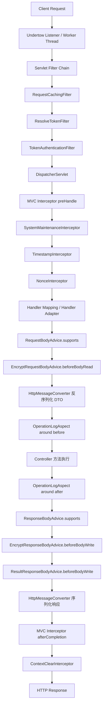
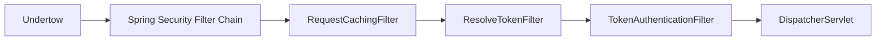
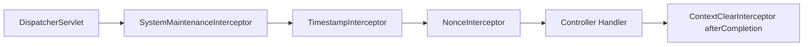
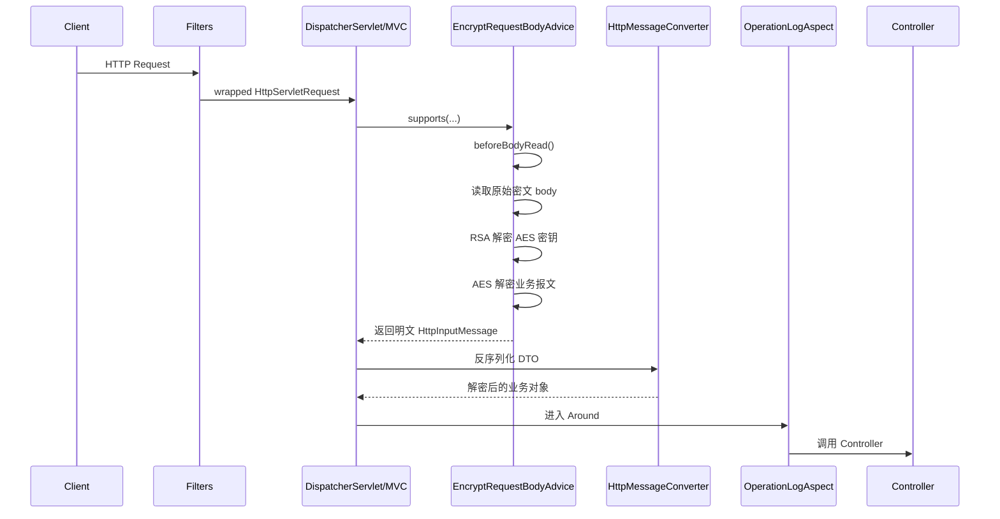
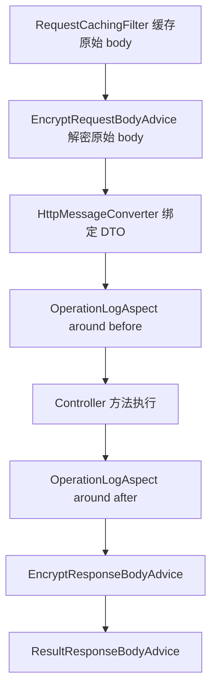
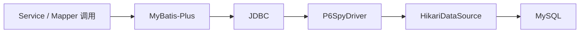

# 项目机制说明

## 1. 项目总览

当前项目是一个基于 Spring Boot 3、Spring Security、Spring MVC、MyBatis-Plus、Redis、P6Spy 的后端模板，重点增强了以下几类能力：

- Undertow 作为嵌入式 Servlet 容器
- Spring Security 无状态认证链路
- 基于 RSA + AES-GCM 的请求解密与响应加密
- 请求体重复读取包装
- MVC 拦截器防重放校验
- ThreadLocal 上下文与线程池上下文透传
- MyBatis-Plus + P6Spy SQL 打印与慢 SQL 监控
- 操作日志、统一返回与全局异常处理

## 2. 请求处理总链路

### 2.1 详细请求时序图

### 2.2 关键结论

- Undertow 负责承载请求并把请求交给 Servlet 体系，但不是当前项目里“请求体为什么后续读空”的核心原因。
- 真正消费请求体的是后续应用链路里的 `RequestCachingFilter`、`RequestBodyAdvice` 和 `HttpMessageConverter`。
- 当前项目最早主动读取原始请求体的是 `RequestCachingFilter`，它会把原始 body 缓存下来，供后续重复读取。
- `EncryptRequestBodyAdvice` 发生在 Controller 调用之前，因此 Controller 入参是解密后的 DTO。
- AOP 发生在参数绑定之后，但 AOP 再读取 `HttpServletRequest` 时，读到的是“原始缓存请求体”，不是解密后的 DTO 明文。

## 3. 过滤器链

### 3.1 当前过滤器识别图

### 3.2 RequestCachingFilter

位置：

- 在 `SecurityConfiguration` 中通过 `addFilterBefore(requestCachingFilter(), UsernamePasswordAuthenticationFilter.class)` 注册
- 它位于你自定义 token 过滤器之前

职责：

1. 将原始 `HttpServletRequest` 包装为 `RepeatableRequestWrapper`
2. 在 wrapper 构造时调用原始 `request.getInputStream()` 一次性读取 body 到 `byte[]`
3. 后续所有 `getInputStream()` / `getReader()` 调用都改为读取内存副本

效果：

- 解决“原始请求体只能读取一次”的问题
- 让后续 Filter、MVC、AOP、工具类再次读取 `HttpServletRequest` 时不直接变空流

边界：

- 它缓存的是“原始请求体”，不是解密后的明文
- 它对经过该过滤器之后的链路有效
- 若存在比它更早的全局 Servlet Filter 先读 body，则它无法兜底

### 3.3 ResolveTokenFilter

职责：

1. 从 `security.access.header` 指定请求头中取 token
2. 去除 `security.access.prefix`
3. trim 后写入 request attribute
4. 不做认证，只做标准化传递

输出：

- 规范化 token 放在 request attribute 中，供 `TokenAuthenticationFilter` 使用

### 3.4 TokenAuthenticationFilter

职责：

1. 从 request attribute 中取规范化 token
2. 用 `JwtTokenHandler` 解析用户名和用户 ID
3. 校验 token 过期时间
4. 从 Redis 查询权限列表
5. 构造 `UsernamePasswordAuthenticationToken`
6. 写入 `SecurityContextHolder`
7. finally 中清理 `ContextHolder` 和 `SecurityContextHolder`

作用：

- 这是当前项目安全链真正建立登录态和权限信息的地方

## 4. MVC 拦截器链

### 4.1 当前拦截器顺序

`WebMvcConfiguration` 中注册顺序如下：

1. `SystemMaintenanceInterceptor`，`order = -1`
2. `TimestampInterceptor`，`order = 1`
3. `NonceInterceptor`，`order = 2`
4. `ContextClearInterceptor`，`order = Integer.MAX_VALUE`

### 4.2 拦截器识别图

### 4.3 各拦截器职责

#### SystemMaintenanceInterceptor

- 读取 `SysConfigHandler.enableSystemMaintenance()`
- 若开启维护模式，直接拒绝访问

#### TimestampInterceptor

- 读取请求头 `X-Timestamp`
- 校验时间戳与当前服务器时间差
- 用于限制超时重放请求

#### NonceInterceptor

- 读取请求头 `X-Nonce`
- 用 `CacheService.setIfAbsent` 写入缓存
- 若写入失败，则认为 nonce 已被占用，判定为重复提交或重放攻击

#### ContextClearInterceptor

- 在 `afterCompletion` 中统一清理 `ContextHolder`
- 防止容器线程复用导致 ThreadLocal 串数据

## 5. 请求解密、响应加密、统一返回

### 5.1 RequestBodyAdvice 链路

请求进入 Controller 前，Spring MVC 会先处理 `@RequestBody` 绑定。当前项目在这条链路上挂了 `EncryptRequestBodyAdvice`。

详细时序：

### 5.2 EncryptRequestBodyAdvice

职责：

1. 判断是否开启数据传输加密
2. 判断是否标记 `@IgnoreEncrypt`
3. 在 `beforeBodyRead` 中读取请求体
4. 解析为 `EncryptBody`
5. 用 RSA 私钥解出当前请求 AES 密钥
6. 写入 `EncryptContext`
7. 用 AES-GCM 解出业务明文
8. 构造新的 `HttpInputMessage` 交给 `HttpMessageConverter`

关键结论：

- Controller 最终拿到的是解密后的 DTO
- `HttpServletRequest` 本身并不会被替换成“明文 body request”
- 因此后面再从 `HttpServletRequest` 读取，得到的是原始缓存请求体，不是解密后的 DTO 明文

### 5.3 ResponseBodyAdvice 链路

当前项目挂了两个响应 Advice：

1. `EncryptResponseBodyAdvice`
2. `ResultResponseBodyAdvice`

大致顺序：

- 先判断是否需要响应加密
- 若需要，使用 `EncryptContext` 中的 AES 密钥加密响应数据
- 再由 `ResultResponseBodyAdvice` 包装成统一响应结构

### 5.4 EncryptResponseBodyAdvice

职责：

1. 判断是否开启数据传输加密
2. 判断是否标记 `@IgnoreEncrypt`
3. 从 `EncryptContext` 取当前请求 AES 密钥
4. 将响应对象序列化为字符串
5. 使用 AES-GCM 加密
6. 返回 `EncryptResult`

### 5.5 ResultResponseBodyAdvice

职责：

- 普通对象包装为 `Result.success(data)`
- `EncryptResult` 包装成包含 `data` 和 `iv` 的统一结构
- `String` 响应转为 JSON 字符串

## 6. AOP 与请求体读取关系

### 6.1 AOP 位置

`OperationLogAspect` 拦截的是标记了 `@OperationLog` 的 Controller 方法。

时机上它发生在：

- `RequestCachingFilter` 之后
- `EncryptRequestBodyAdvice` 之后
- `HttpMessageConverter` 参数绑定之后
- Controller 方法体执行前后

### 6.2 AOP 在链路中的精确位置

### 6.3 当前 OperationLogAspect 机制

当前切面会做这些事：

- 读取 `@OperationLog` 注解元数据
- 采集 URL、方法、IP
- 使用 `joinPoint.getArgs()` 记录请求参数
- 从 `ContextHolder.getUserContext()` 获取用户信息
- 记录返回结果
- 异步写入 `operation_log`

结论：

- 当前切面主要依赖方法参数而不是再次从 `request` 读 body
- 若需要再次从 `request` 读原始请求体，`RequestCachingFilter` 能支撑这种重复读取
- 若要拿解密后的业务明文，优先使用 `joinPoint.getArgs()`，而不是 `HttpServletRequest`

## 7. RequestCachingFilter 的边界

### 7.1 它能保证什么

对当前项目主链路来说，它可以保证：

- `EncryptRequestBodyAdvice` 读取过原始 body 后
- 后续其他代码再次读取 `HttpServletRequest`
- 不会因为“单次流已消费”直接拿到空流

### 7.2 它不能保证什么

它不能保证：

- `HttpServletRequest` 里自动变成解密后的明文 body
- 大文件 / `multipart` 下的低内存占用
- 在它之前已经有其他全局 Filter 读过 body 的情况

## 8. ThreadLocal 上下文机制

### 8.1 ContextHolder

`ContextHolder` 统一持有两类上下文：

- `UserContext`
- `EncryptContext`

### 8.2 UserContext

保存：

- `userId`
- `userName`
- `userToken`

用途：

- 操作日志
- 业务身份透传
- 异步线程上下文补齐

### 8.3 EncryptContext

保存：

- 当前请求解出的 AES 密钥

用途：

- 请求解密与响应加密之间复用同一把对称密钥

### 8.4 清理机制

当前项目有两层清理：

- `TokenAuthenticationFilter` finally 清理
- `ContextClearInterceptor.afterCompletion` 兜底清理

## 9. 线程池上下文透传

### 9.1 ContextCopyingDecorator

透传内容：

- `RequestAttributes`
- `SecurityContext`
- `UserContext`
- `EncryptContext`

### 9.2 执行流程

1. 主线程抓取上下文快照
2. 包装异步任务
3. 子线程执行前恢复上下文
4. 执行业务逻辑
5. finally 清理

## 10. 系统配置与缓存机制

### 10.1 SysConfigHandler

统一读取系统配置，对外提供：

- 是否开启数据传输加密
- 是否开启系统维护
- 是否开启防重放
- token 过期时间
- nonce 过期时间
- 操作日志开关

### 10.2 ConfigCacheLoader

应用启动后执行：

- 主动把已启用的系统配置加载进缓存

### 10.3 更新配置后的刷新机制

`SysConfigServiceImpl` 在更新配置值和状态后会调用：

- `SysConfigHandler.refreshConfigCache`

保证缓存与数据库一致。

## 11. SQL 日志与慢 SQL 机制

### 11.1 数据库代理链路

当前项目使用 `P6SpyDriver` 代理 JDBC 链路：

### 11.2 当前接入方式

在 `application.yml` 中：

- `spring.datasource.driver-class-name = com.p6spy.engine.spy.P6SpyDriver`
- `spring.datasource.url = jdbc:p6spy:mysql://...`

这意味着：

- 真实 JDBC 调用先进入 P6Spy 代理
- 再由 P6Spy 转发给真实 MySQL 驱动

### 11.3 spy.properties 机制

`spy.properties` 里当前关键配置如下：

- `modulelist=com.baomidou.mybatisplus.extension.p6spy.MybatisPlusLogFactory,com.p6spy.engine.outage.P6OutageFactory`
- `logMessageFormat=com.security.backend.config.SqlLoggerConfiguration`
- `appender=com.security.backend.config.SqlLoggerConfiguration`
- `excludecategories=info,debug,result,commit,resultset`
- `outagedetection=true`
- `outagedetectioninterval=2`

### 11.4 普通 SQL 打印机制

普通 SQL 打印依赖：

- `MybatisPlusLogFactory`
- `SqlLoggerConfiguration`

执行逻辑：

1. MyBatis-Plus 发起 SQL
2. JDBC 调用进入 P6Spy
3. `MybatisPlusLogFactory` 负责生成 SQL 日志事件
4. P6Spy 调用 `SqlLoggerConfiguration.formatMessage(...)`
5. 格式化后通过 `logText(...)` 写入日志系统

当前 `SqlLoggerConfiguration` 行为：

- 对 SQL 做空白压缩
- 输出类似 `完整SQL：...`
- 通过 `log.debug(...)` 打到 `com.security.backend` 日志体系

### 11.5 慢 SQL 机制

慢 SQL 依赖：

- `P6OutageFactory`
- `outagedetection=true`
- `outagedetectioninterval=2`

执行逻辑：

1. P6Spy 记录每个 JDBC 执行耗时
2. `P6OutageFactory` 监控执行时间
3. 当 SQL 执行时间超过 2 秒时，认定为慢 SQL
4. 慢 SQL 事件仍通过当前 appender/logger 体系输出

### 11.6 为什么要同时看 application.yml 和 spy.properties

因为当前 SQL 日志机制分成两层：

- `application.yml`
  决定是否通过 `P6SpyDriver` 进入代理链路
- `spy.properties`
  决定代理链路里的日志模块、慢 SQL 检测、日志格式和输出方式

### 11.7 当前项目中的实际结论

- 你现在不是 Spring Boot starter 自动装饰 DataSource 的模式
- 你是 MyBatis-Plus 官方文档那种 `P6SpyDriver + spy.properties` 模式
- 普通 SQL 和慢 SQL 都经过 P6Spy
- 慢 SQL 阈值当前是 2 秒

## 12. 当前实现的关键判断

### 12.1 关于 Undertow

- Undertow 不是“请求体为什么后面是空”的根因
- 它只是承载请求，真正决定 body 是否还能重读的是后续应用链路的包装与消费方式

### 12.2 关于 RequestCachingFilter

- 对“原始请求体可重复读取”这个目标，它是有效的
- 对“让 request 里直接变成解密后的明文 body”这个目标，它无效

### 12.3 关于 AOP

- AOP 在解密和参数绑定之后执行
- AOP 里如果读取 `joinPoint.getArgs()`，拿到的是解密后的业务对象
- AOP 里如果读取 `HttpServletRequest`，拿到的是原始缓存请求体
