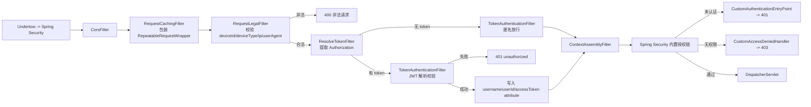
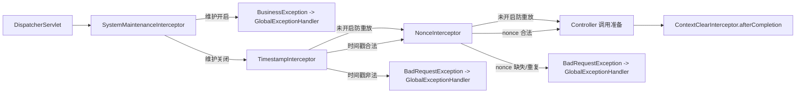

# 项目说明

## 作用

这是一个基于 Spring Boot 3 的安全后端模板，当前已经把下面这些通用能力串成了统一执行链：

- Undertow 请求承载
- Spring Security 无状态认证
- JWT 请求鉴权
- 请求体重复读取
- 请求合法性校验
- 系统维护开关
- 防重放校验
- 请求解密 / 响应加密
- 操作日志切面
- MyBatis Plus 拦截器
- P6Spy SQL 日志与慢 SQL 监控
- ThreadLocal 上下文装配与清理

它解决的不是单个业务问题，而是把“请求进入系统以后每一层怎么处理”这件事统一掉，避免后续业务开发再重复搭基础链路。

## 过滤器执行链

当前自定义过滤器由 [SecurityConfiguration](src/main/java/com/security/backend/config/SecurityConfiguration.java) 注册，真实顺序如下：

| 顺序 | 过滤器 | 作用 | 解决的问题 | 分叉 |
| --- | --- | --- | --- | --- |
| 0 | `CorsFilter` | Spring 默认跨域过滤器 | 统一处理跨域请求 | 无 |
| 1 | `RequestCachingFilter` | 把 `HttpServletRequest` 包装成 `RepeatableRequestWrapper` | 解决请求体只能读取一次的问题 | 无 |
| 2 | `RequestLegalFilter` | 校验 `deviceId`、`deviceType`、IP、`User-Agent`，并写入 request attribute | 统一拦截非法请求，统一沉淀设备与网络信息 | 校验失败直接返回 `400` |
| 3 | `ResolveTokenFilter` | 从 `security.access.header` 读取 token，去掉前缀后写入 request attribute | 统一 token 提取逻辑 | 请求头无 token 时直接放行 |
| 4 | `TokenAuthenticationFilter` | 校验 JWT，解析 `username` / `userId`，写入 request attribute | 统一完成身份校验 | token 缺失时放行；token 非法时直接返回 `401` |
| 5 | `ContextAssemblyFilter` | 从 request attribute 组装 `RequestContext`、`UserContext`、`SecurityContextHolder` | 统一完成上下文装配 | 匿名请求用户字段可能为空 |
| 6 | Spring Security 内置过滤器 | 继续执行框架默认授权链 | 统一使用 Spring Security 鉴权 | 未认证进入 `CustomAuthenticationEntryPoint`；无权限进入 `CustomAccessDeniedHandler` |

### 过滤器链细节

#### 1. `RequestCachingFilter`

作用：

- 在进入后续 Spring Security 和 Spring MVC 之前缓存原始请求体。
- 后续再次调用 `getInputStream()` / `getReader()` 时，读取的是包装器里的缓存字节。

解决的问题：

- 解决 `HttpServletRequest` 原始输入流只能消费一次的问题。
- 解决 Filter、Advice、AOP、工具类再次读请求体时拿到空流的问题。

边界：

- 缓存的是原始报文，不是解密后的明文。
- 它发生在应用过滤器链里，不是在 Undertow 之前；Undertow 把请求交给应用后，真正负责“重复读取”的是这个包装器。

#### 2. `RequestLegalFilter`

作用：

- 基于 `HttpServletUtils.isRequestValid()` 统一校验请求合法性。
- 成功后把 `deviceId`、`deviceType`、`ipv4`、`ipv6`、`userAgent` 写入 request attribute。

解决的问题：

- 把设备信息和网络信息采集前置。
- 避免 Controller / Service 再重复校验基础请求元信息。

失败分支：

- 任一项不合法，直接 `new HttpServletUtils(response).writeResponseBody(400, "非法请求")`。

#### 3. `ResolveTokenFilter`

作用：

- 从 `security.access.header` 读取 token。
- 如果配置了前缀，例如 `Bearer `，先去掉前缀再放到 request attribute。

解决的问题：

- 避免下游过滤器自己处理前缀和 header 名称。

#### 4. `TokenAuthenticationFilter`

作用：

- 从 request attribute 读取 access token。
- 调用 `JwtTokenHandler` 解析并校验 token。
- 成功后把 `username`、`accessToken`、`userId` 写入 request attribute。

解决的问题：

- 统一 JWT 解析、过期校验、无效 token 返回格式。

分叉：

- 没有 token：直接放行，允许匿名链路继续走。
- token 解析失败 / 用户信息为空 / token 过期：直接返回 `401`。
- token 校验成功：进入上下文组装阶段。

#### 5. `ContextAssemblyFilter`

作用：

- 从 request attribute 读取请求元信息和用户信息。
- 写入 `ContextHolder.getRequestContext()`、`ContextHolder.getUserContext()`。
- 同时写入 `SecurityContextHolder`。

解决的问题：

- 统一把前面过滤器采集到的数据装配到 ThreadLocal 上下文。
- 让 Controller、Service、AOP、异步任务都能通过上下文拿到当前请求信息。

说明：

- 设备信息来自 `RequestLegalFilter`。
- 用户信息来自 `TokenAuthenticationFilter`。
- 当前实现对匿名请求也会执行上下文组装，只是用户字段可能为 `null`。

### 安全异常分支

#### `CustomAuthenticationEntryPoint`

作用：

- 处理未认证请求。

解决的问题：

- 把 Spring Security 的未认证异常统一转成 JSON `401` 响应。

#### `CustomAccessDeniedHandler`

作用：

- 处理已认证但无权限的请求。

解决的问题：

- 把 Spring Security 的拒绝访问统一转成 JSON `403` 响应。

### 过滤器执行图

## 拦截器执行链

当前 MVC 拦截器由 [WebMvcConfiguration](src/main/java/com/security/backend/config/WebMvcConfiguration.java) 注册，真实顺序如下：

| 顺序 | 拦截器 | 作用 | 解决的问题 | 分叉 |
| --- | --- | --- | --- | --- |
| `-1` | `SystemMaintenanceInterceptor` | 根据系统配置判断是否维护中 | 统一维护模式入口 | 开启维护直接抛异常 |
| `1` | `TimestampInterceptor` | 校验 `X-Timestamp` | 统一请求时效校验 | 未开启防重放时直接跳过 |
| `2` | `NonceInterceptor` | 校验 `X-Nonce` 是否重复 | 统一防重复提交 / 防重放 | 未开启防重放时直接跳过 |
| `Integer.MAX_VALUE` | `ContextClearInterceptor` | `afterCompletion` 清理 `ContextHolder` | 防止 ThreadLocal 污染 | 无 |

### 拦截器链细节

#### 1. `SystemMaintenanceInterceptor`

作用：

- 调用 `SysConfigHandler.enableSystemMaintenance()` 判断系统维护开关。

解决的问题：

- 让系统维护模式有统一阻断入口，而不是散落在业务代码里。

分叉：

- 开启：抛出 `BusinessException("系统维护中暂不可使用")`，交给 `GlobalExceptionHandler`。
- 关闭：继续后续链路。

#### 2. `TimestampInterceptor`

作用：

- 读取 `X-Timestamp`。
- 调用 `SysConfigHandler.queryReplayAttackTimeoutSeconds()` 获取允许时间差。

解决的问题：

- 统一请求时效校验。
- 防止过期请求继续进入业务层。

分叉：

- `REPLAY_ATTACK_ENABLED=false` 或超时时间未配置：直接跳过。
- 已开启但时间戳缺失 / 格式错误 / 已过期：抛 `BadRequestException`。

#### 3. `NonceInterceptor`

作用：

- 读取 `X-Nonce`。
- 调用 `CacheService.setIfAbsent()` 把 nonce 写入缓存。

解决的问题：

- 防止相同请求在有效期内重复提交。
- 防止简单重放攻击。

分叉：

- `REPLAY_ATTACK_ENABLED=false` 或 nonce 过期秒数未配置：直接跳过。
- nonce 缺失：抛 `BadRequestException`。
- nonce 已存在：抛 `BadRequestException("请求已重复提交")`。

#### 4. `ContextClearInterceptor`

作用：

- 在 `afterCompletion` 统一执行 `ContextHolder.clear()`。

解决的问题：

- 防止 Undertow 工作线程复用时，旧请求的 ThreadLocal 数据串到新请求。

### 拦截器执行图

## Advice / AOP / 上下文链

### `EncryptRequestBodyAdvice`

作用：

- 在 `HttpMessageConverter` 绑定 `@RequestBody` 参数之前解密请求体。
- 解密完成后把 AES 密钥写入 `EncryptContext`。

解决的问题：

- 让 Controller / Service 接收到的已经是明文 DTO。
- 让响应加密阶段复用同一次请求的 AES 密钥。

分叉：

- `DATA_TRANSFER_ENCRYPT=false`：不进入解密链。
- 方法或类标注 `@IgnoreEncrypt`：跳过解密。
- 只对真正触发请求体读取的参数绑定生效。

说明：

- AOP 在 Controller 方法调用时执行，所以如果这里已经解密成功，那么 `@OperationLog` 切面拿到的 `joinPoint.getArgs()` 是解密后的 DTO。
- 如果再去读 `HttpServletRequest` 原始流，读到的是 `RequestCachingFilter` 缓存的原始报文，不是 Advice 替换后的 DTO 对象。

### `OperationLogAspect`

作用：

- 拦截标注 `@OperationLog` 的方法。
- 记录模块、描述、请求地址、IP、参数、响应、执行耗时。

解决的问题：

- 统一关键操作审计。
- 统一收集请求上下文和业务返回值。

分叉：

- `OPERATION_LOG=false`：直接 `joinPoint.proceed()`，不记录日志。
- `OPERATION_LOG=true`：进入环绕通知，方法执行完成后异步保存操作日志。

### `EncryptResponseBodyAdvice`

作用：

- 在响应写回前根据 `EncryptContext` 中的 AES 密钥加密响应体。

解决的问题：

- 保证请求明文 DTO 对应的响应也能走同一条加密链路。

顺序：

- `getOrder() = 0`，先于 `ResultResponseBodyAdvice` 执行。

分叉：

- `DATA_TRANSFER_ENCRYPT=false`：跳过。
- 方法或类标注 `@IgnoreEncrypt`：跳过。
- `EncryptContext` 中没有 AES 密钥：跳过。

### `ResultResponseBodyAdvice`

作用：

- 统一把 Controller 返回值包装成 `Result`。

解决的问题：

- 统一所有接口的返回结构。

顺序：

- `getOrder() = 1`，在 `EncryptResponseBodyAdvice` 之后执行。

包装规则：

- 返回值本身是 `Result`：直接透传。
- 返回值是 `EncryptResult`：包装成 `Result.success(data, iv)`。
- 返回值是 `String`：转成 JSON 字符串形式的 `Result.success(...)`。
- 其他对象：包装成 `Result.success(body)`。

### `GlobalExceptionHandler`

作用：

- 统一处理业务异常、参数异常、请求体异常和兜底系统异常。

解决的问题：

- 把异常链路统一转成可控 JSON 响应。

说明：

- 它同时标注了 `@IgnoreResult` 和 `@IgnoreEncrypt`。
- 所以异常响应不会再次进入统一包装和响应加密链。

### 上下文传递机制

当前上下文通过 `ContextHolder` 统一持有：

- `RequestContext`：设备信息、IP、`User-Agent`
- `UserContext`：`userId`、`username`、`accessToken`
- `EncryptContext`：当前请求的 AES 密钥

作用：

- 在 Filter、Interceptor、Advice、AOP、Service 之间共享当前请求状态。

解决的问题：

- 避免层层方法传参。
- 避免请求解密和响应加密之间丢失 AES 密钥。

异步线程补充：

- `ContextCopyingDecorator` 会把当前线程的上下文复制到异步线程。
- 解决异步日志、异步任务拿不到当前用户和加密上下文的问题。

## 一次完整的请求执行链

下面这张图按真实实现串起 Undertow、Filter、Security、MVC Interceptor、Advice、AOP、MyBatis Plus、P6Spy，并把系统配置开关的分叉写出来。

```mermaid
flowchart TD
    A["客户端请求"] --> B["Undertow 接入请求"]
    B --> C["CorsFilter"]
    C --> D["RequestCachingFilter<br/>缓存原始请求体"]
    D --> E["RequestLegalFilter<br/>校验设备/IP/User-Agent"]
    E -->|非法| E1["400 非法请求"]
    E -->|合法| F["ResolveTokenFilter<br/>提取并规范化 token"]
    F --> G{"请求头中是否有 token"}
    G -->|无| H["TokenAuthenticationFilter 匿名放行"]
    G -->|有| I["TokenAuthenticationFilter 校验 JWT"]
    I -->|失败| I1["401 unauthorized"]
    I -->|成功| J["写入 username/userId/accessToken attribute"]
    H --> K["ContextAssemblyFilter<br/>组装 RequestContext/UserContext/SecurityContext"]
    J --> K
    K --> L["Spring Security 授权"]
    L -->|未认证| L1["CustomAuthenticationEntryPoint -> 401"]
    L -->|无权限| L2["CustomAccessDeniedHandler -> 403"]
    L -->|通过| M["DispatcherServlet"]
    M --> N["SystemMaintenanceInterceptor"]
    N -->|维护开启| N1["BusinessException -> GlobalExceptionHandler"]
    N -->|维护关闭| O["TimestampInterceptor"]
    O -->|防重放关闭| P["NonceInterceptor"]
    O -->|时间戳非法| O1["BadRequestException -> GlobalExceptionHandler"]
    O -->|时间戳合法| P["NonceInterceptor"]
    P -->|防重放关闭| Q["HandlerMethod 参数解析"]
    P -->|nonce 非法| P1["BadRequestException -> GlobalExceptionHandler"]
    P -->|nonce 合法| Q["HandlerMethod 参数解析"]
    Q --> R{"DATA_TRANSFER_ENCRYPT 是否开启<br/>且方法未标注 @IgnoreEncrypt"}
    R -->|否| S["HttpMessageConverter 直接绑定 DTO"]
    R -->|是| T["EncryptRequestBodyAdvice<br/>RSA 解密 AES 密钥 + AES 解密请求体"]
    T --> U["HttpMessageConverter 绑定解密后的 DTO"]
    S --> V{"方法是否标注 @OperationLog<br/>且 OPERATION_LOG 是否开启"}
    U --> V
    V -->|否| W["Controller -> Service -> Mapper"]
    V -->|是| X["OperationLogAspect.around<br/>记录参数/响应/耗时"]
    X --> W
    W --> Y["MyBatis Plus 拦截器链<br/>Pagination -> OptimisticLocker -> BlockAttack"]
    Y --> Z["HikariDataSource(P6SpyDriver)"]
    Z --> ZA["P6Spy<br/>MybatisPlusLogFactory + P6OutageFactory"]
    ZA -->|正常 SQL| ZB["SqlLoggerConfiguration 输出完整 SQL"]
    ZA -->|耗时 > 2s| ZC["P6OutageFactory 输出慢 SQL"]
    ZB --> ZD["MySQL"]
    ZC --> ZD
    ZD --> ZE["返回业务结果"]
    ZE --> ZF{"是否抛出异常"}
    ZF -->|是| ZG["GlobalExceptionHandler<br/>@IgnoreResult + @IgnoreEncrypt"]
    ZF -->|否| ZH{"DATA_TRANSFER_ENCRYPT 是否开启<br/>且方法未标注 @IgnoreEncrypt"}
    ZH -->|否| ZI["跳过 EncryptResponseBodyAdvice"]
    ZH -->|是| ZJ["EncryptResponseBodyAdvice(order=0)<br/>使用 AES 密钥加密响应"]
    ZI --> ZK["ResultResponseBodyAdvice(order=1)<br/>统一包装 Result"]
    ZJ --> ZK
    ZG --> ZL["直接返回异常 Result"]
    ZK --> ZM["写回响应"]
    ZL --> ZM
    ZM --> ZN["ContextClearInterceptor.afterCompletion"]
    ZN --> ZO["HTTP 响应返回客户端"]
```

## SQL 执行链

### MyBatis Plus

作用：

- 在 Mapper 执行前统一经过 `MybatisPlusInterceptor`。

解决的问题：

- `PaginationInnerInterceptor`：统一分页能力。
- `OptimisticLockerInnerInterceptor`：统一乐观锁更新控制。
- `BlockAttackInnerInterceptor`：阻断无条件更新 / 删除。

### P6Spy

作用：

- 代理 JDBC 驱动，记录实际执行 SQL。
- 额外开启慢 SQL 检测。

解决的问题：

- 开发阶段可以直接看到完整 SQL。
- 超过阈值的 SQL 会被额外标记出来，便于排查性能问题。

当前接入方式：

- `spring.datasource.driver-class-name = com.p6spy.engine.spy.P6SpyDriver`
- `spring.datasource.url = jdbc:p6spy:mysql://...`
- `spy.properties` 中启用：
  - `com.baomidou.mybatisplus.extension.p6spy.MybatisPlusLogFactory`
  - `com.p6spy.engine.outage.P6OutageFactory`
- `SqlLoggerConfiguration` 负责格式化 SQL 输出

慢 SQL 规则：

- `outagedetection=true`
- `outagedetectioninterval=2`
- 单条 SQL 执行时间超过 2 秒时，进入慢 SQL 输出分支

## 当前实现里需要开发者明确知道的边界

### 1. `CustomAuthenticationSuccessHandler` / `CustomAuthenticationFailureHandler`

作用：

- 处理登录成功 / 失败时的专用返回逻辑。

说明：

- 当前代码里已经存在这两个 Handler。
- 但在现有 [SecurityConfiguration](src/main/java/com/security/backend/config/SecurityConfiguration.java) 中，没有显式挂接自定义登录过滤器或 `formLogin()` 成功 / 失败处理器。
- 所以它们不是当前普通请求主链上的自动执行节点，只有在后续显式接入登录认证入口后才会进入真实链路。

### 2. `RequestCachingFilter` 与解密后的请求体不是同一个概念

作用：

- `RequestCachingFilter` 解决的是“原始请求体能重复读取”。
- `EncryptRequestBodyAdvice` 解决的是“业务层拿到解密后的 DTO”。

解决的问题：

- 避免把“重复读取”误认为“所有层都能直接读到解密明文”。

### 3. AOP 看到的是哪个请求体

作用：

- `OperationLogAspect` 如果看 `joinPoint.getArgs()`，拿到的是参数绑定后的对象。

解决的问题：

- 当数据传输加密开启时，AOP 拿到的是解密后的 DTO，而不是密文。
- 如果 AOP 自己再次去读 `HttpServletRequest` 输入流，读到的是 `RequestCachingFilter` 缓存的原始请求体。

